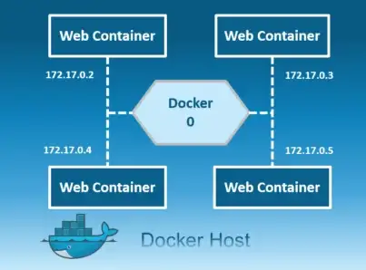
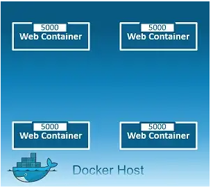
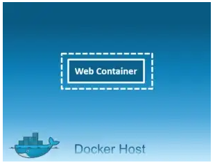
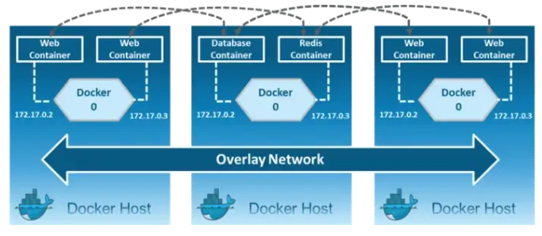
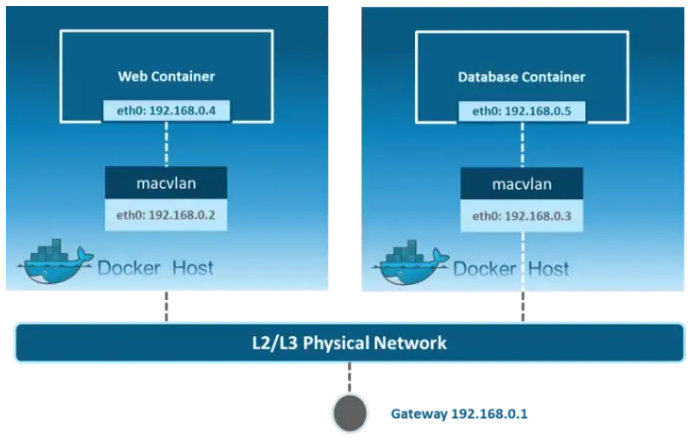

# Network Drivers

- There are mainly 5 network drivers: Bridge, Host, None, Overlay, Macvlan

## Bridge:

- This is a private default internal network created by docker on the host. So, all containers get an internal IP address and these containers can access each other, using this internal IP. The Bridge networks are usually used when your applications run in standalone containers that need to communicate.

## Host:

- This driver removes the network isolation between the docker host and the docker containers to use the host’s networking directly. So with this, you will not be able to run multiple web containers on the same host, on the same port as the port is now common to all containers in the host network.

## None:

- In this kind of network, containers are not attached to any network and do not have any access to the external network or other containers. So, this network is used when you want to completely disable the networking stack on a container and, only create a loopback device.

## Overlay:

- Creates an internal private network that spans across all the nodes participating in the swarm cluster. So, Overlay networks facilitate communication between a swarm service and a standalone container, or between two standalone containers on different Docker Daemons.

## Macvlan:

- Allows you to assign a MAC address to a container, making it appear as a physical device on your network. Then, the Docker daemon routes traffic to containers by their MAC addresses. Macvlan driver is the best choice when you are expected to be directly connected to the physical network, rather than routed through the Docker host’s network stack. 

